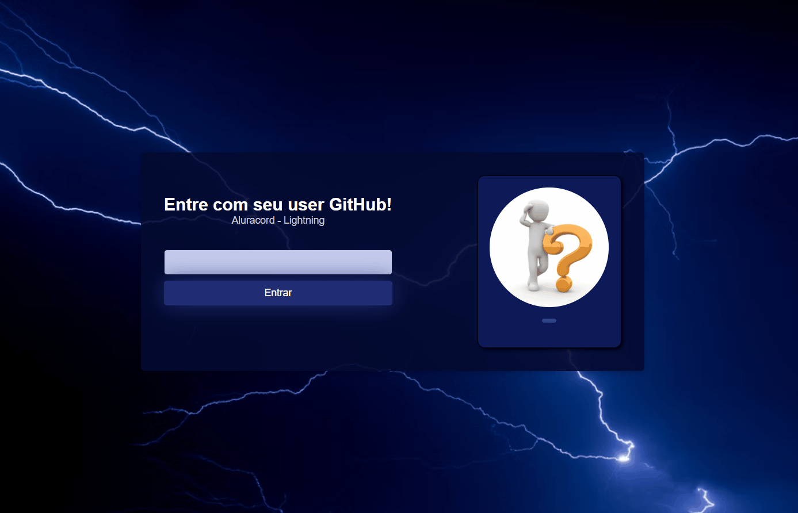

# Aluracord - Lightning

Projeto feito na Imersão React 4 da <a href="https://www.alura.com.br/">Alura</a> com <a href="https://github.com/omariosouto">@omariosouto</a> e o <a href="https://github.com/peas">@peas</a>, utilizando a lib brasileira <a href="https://github.com/skynexui/components">@skynexui</a>.

#

Esse é um chat que utilizando o user do seu GitHub, poderá acessar e se comunicar com outras pessoas, adicionei funcionalidades como:

- Apenas usuários GitHub permitido
- Debounce para não fazer requisição à cada letra digitada
- Botão enviar
- Adicionado botão para remover e apenas o dono da mensagem pode o fazer
- Tema diferente do original
- Estilo no CSS para separar mensagens próprias de outros usuários
- Ao passar o mouse em cima da foto do usuário, mostrar algumas informações do próprio



#

<div style="display:inline-block">


  </div>

#

## Como executar o projeto

Para executar o projeto você precisa ter o [Node.js](https://nodejs.dev) e o [Git](https://git-scm.com) instalados na sua maquina. Você também precisará de um editor de textos, eu utilizei o [VSCode](https://code.visualstudio.com).

1. Clone esse repositório.

```
git clone https://github.com/isaaacwillian/aluracord-lightning.git
```

2. Acesse a pasta do projeto.

3. Instale as dependências.

```
npm install
```

4. Execute a aplicação em modo de desenvolvimento.

```
npm run dev 
```

#

Made with ❤️
